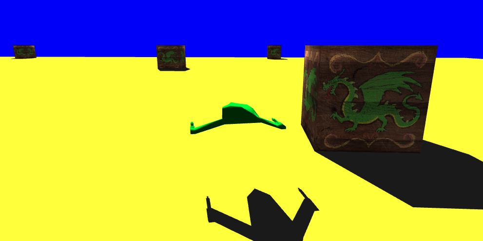
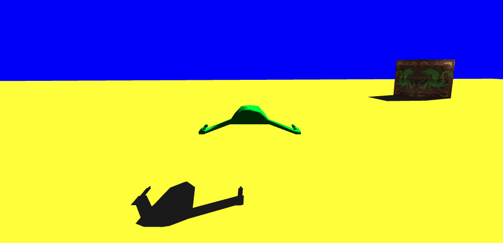
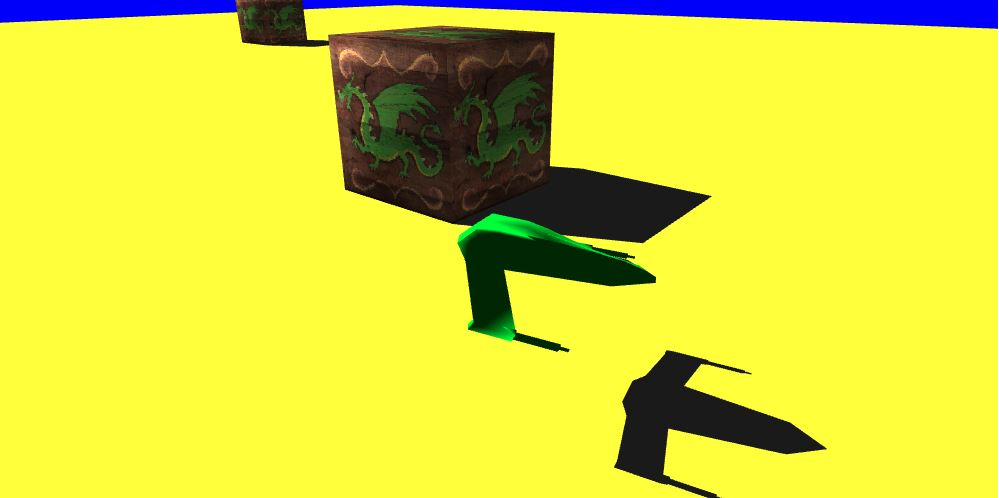

# WebGL-Textures

In this activity we have to add textures to the cubes in the scene. In addition to adding the features of the Pawn movement and shadows activities.

## Adding textures to the scene cubes.

First we need to define the assets for the use of textures in Retreivals.cs, we change AssetType to add a new enum to identify the texture.

```
public enum AssetType : byte {
        StaticMesh,
        Texture
    }
```

And we add the RetrievedTexture class, here the json of the level will be loaded:

```
public class RetrievedTexture : RetrievedAsset {
        public byte[] Rgba32DecodedImage; 
        public int Width{get; set;}
        public int Height{get; set;}
    }
```

We add in level.json a new list with the textures of the scene, in addition we add a new attribute to the actors of the level to indicate its texture.

```
"texture_list" : [
        {
            "file" : "assets/greendragon.jpg",
            "id" : "tex1"
        },

        {
            "file" : "assets/greendragon.jpg",
            "id" : "tex2"
        }

    ],
```

```
{
            "id" : "aprop2",
            "type" : "staticmesh",

            "sm" : "cube",
            "shadow" : true,

            "enabled" : true,
            "position" : [10.0,0.0,10.0],
            "orientation" : {
                "axis" : [0.0,1.0,0.0],
                "angle" : 0.0
            },
            "scale" : [1.0,1.0,1.0],
            "basecolor" : [1.0,0.0,0.0,1.0],
            "texture" : "tex1",
            "collisionbox" : true


        }
```

Now we create a new shader for the textures in fsSourceTexture, and we modify fsSourceTexture to add a new sampler2D uniform representing an element that shows the texture.

We also have a new buffer for textures "TextureBuffers" with texture information.

Draw's task changes, now it sends commands that are independent of the actors in the scene. Then we have two loops on the actors, the first for those using colored materials, and the second for textures (Later we will add another loop for the shadows):

```
public async Task Draw(){
        await this._context.BeginBatchAsync();
        await preparePipeLine();
        await updateLightUniforms(); 
        await objectIndependentUniforms();

        // Now, loop on objects with programBaseColor
        await this._context.UseProgramAsync(this.programBaseColor);
        await this.getAttributeLocationsBaseColor();
        foreach (var keyval in ActiveLevel.ActorCollection){
          GameFramework.Actor actor = keyval.Value;
          await actorDependentOperations(actor,GameFramework.MaterialType.BaseColor);
        }

        // Now, loop on objects with programTexture
        await this._context.UseProgramAsync(this.programTexture);
        await this.getAttributeLocationsTexture();
        foreach (var keyval in ActiveLevel.ActorCollection){
          GameFramework.Actor actor = keyval.Value;
          await actorDependentOperations(actor,GameFramework.MaterialType.Texture);
        }

        await this._context.EndBatchAsync();
    }
```

The actorDependentOperations task concentrates all operations in the context of WebGL.

Example of the implemented texture:



## Adding the activities of other projects:

### 1 - Pawn movement.

This section is exactly the same as in the first activity, we modify the "Controller.razor.cs" file to add the keyDownEvent() and keyupEvent() events.
keyDownEvent() occurs when we press the key, and we make a calculation with the yaw angle to know which direction to move within the XZ plane and keyupEvent() is called when we stop pressing the key and sets to 0 all the impulses in XYZ.

-> keydownEvent() function:
```
        private void keydownEvent(KeyboardEventArgs e){
            Console.WriteLine("KeyDown");
            double f = System.Math.PI/180;                        
            double yaw = f*boomAngles.Yaw;
            switch(e.Key){
                case "w" :
                    MovementInput.x = -(float)System.Math.Sin(yaw);
                    MovementInput.z = -(float)System.Math.Cos(yaw);
                    MovementInput.y=0.0f;
                    MovementInput = this.ScaleMovement* MovementInput;
                    break;
                case "s":
                    MovementInput.x = (float)System.Math.Sin(yaw);
                    MovementInput.z = (float)System.Math.Cos(yaw);
                    MovementInput.y=0.0f;
                    MovementInput = this.ScaleMovement* MovementInput;
                    break;
                default:
                    break;
                    

            }
        }
```

-> keyupEvent() function:
```
        private void keyupEvent(KeyboardEventArgs e){
            Console.WriteLine("keyUp"); 
            MovementInput.x = 0.0f;
            MovementInput.y = 0.0f;
            MovementInput.z= 0.0f;
        }
```
With this we can add movement to the project:



### 2 - Adding Shadows.

This activity changes a little bit from the previous one, as before, we define a fragment shader for the shadow:

```
private const string fsShadowSource=@"
        precision mediump float;
        void main(){
            gl_FragColor = vec4(0.0, 0.0, 0.0, 0.9);
        }";
```

We define a new program that renders the shadows with the correct color among other variables:

```
    private WebGLShader shadowFragmentShader;
    private WebGLProgram shadowProgram;

    private int shadowPositionAttribLocation;
    private int shadowNormalAttribLocation;
    private int shadowColorAttribLocation;
    
    private WebGLUniformLocation shadowProjectionUniformLocation;
    private WebGLUniformLocation shadowModelViewUniformLocation;
    private WebGLUniformLocation shadowNormalTransformUniformLocation;
```

The getAttributeLocations() function changes and now they are separated, so we create one for the shadows:

```
  private async Task getAttributeLocationsShadow(){
        this.positionAttribLocation = await this._context.GetAttribLocationAsync(this.shadowProgram,"aVertexPosition");
        this.normalAttribLocation = await this._context.GetAttribLocationAsync(this.shadowProgram,"aVertexNormal");

        this.colorAttribLocation = await this._context.GetAttribLocationAsync(this.shadowProgram,"aVertexColor");
        this.texCoordAttribLocation=await this._context.GetAttribLocationAsync(this.shadowProgram,"aTexCoord");

        this.projectionUniformLocation=await this._context.GetUniformLocationAsync(this.shadowProgram,"uProjectionMatrix");
        this.modelViewUniformLocation = await this._context.GetUniformLocationAsync(this.shadowProgram,"uModelViewMatrix");
        this.normalTransformUniformLocation = await this._context.GetUniformLocationAsync(this.shadowProgram,"uNormalTransformMatrix");
   }
```

We create a task called shadowOperations() similar to actorDependentOperations() that concentrates all operations in the context of WebGL for shadows:

```
    private async Task shadowOperations(GameFramework.Actor actor, GameFramework.MaterialType materialType){
        if(!actor.Enabled) 
            return;
        if(!(actor.Type==SimpleGame.GameFramework.ActorType.StaticMesh)) 
            return;
           
        await this._context.UniformMatrixAsync(this.normalTransformUniformLocation,false,actor.NormalTransform.GetArray());

        MeshBuffers mBuffers = MeshBufferCollection[actor.StaticMeshId]; 
        // Buffers to attributes
        await bufferToAttributes(mBuffers);

        foreach(var smv in actor.ModelViewShadow){
            await this._context.UniformMatrixAsync(this.modelViewUniformLocation,false,smv.GetArray());
        }

        await this._context.BindBufferAsync(BufferType.ELEMENT_ARRAY_BUFFER, mBuffers.IndexBuffer);
        await this._context.DrawElementsAsync(Primitive.TRIANGLES,mBuffers.NumberOfIndices,DataType.UNSIGNED_SHORT, 0);
        
    }
```

We update the Draw task with a new loop:

```
        // Loop on objects with programShadow
        await this._context.UseProgramAsync(this.shadowProgram);
        await this.getAttributeLocationsShadow();
        foreach (var keyval in ActiveLevel.ActorCollection){
            GameFramework.Actor actor = keyval.Value;
            await shadowOperations(actor,GameFramework.MaterialType.BaseColor);
        }
```

With this we can add shadows to the project:


